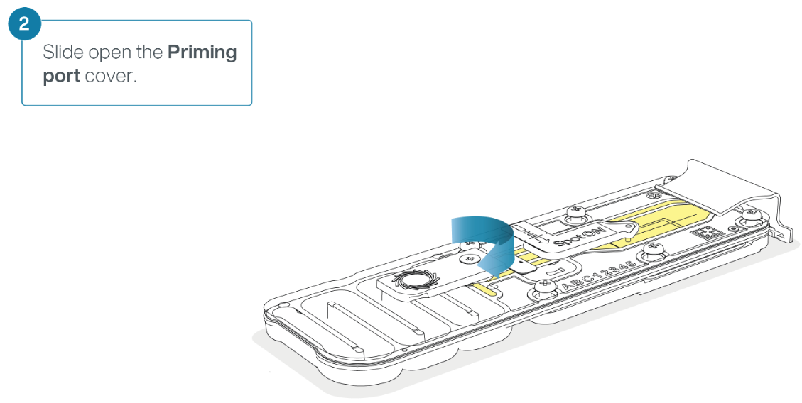
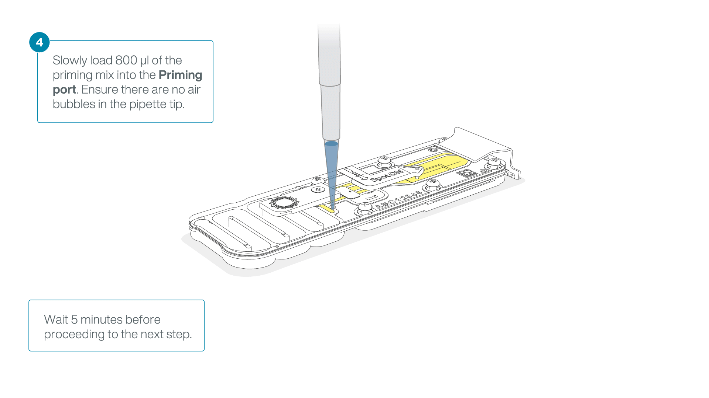
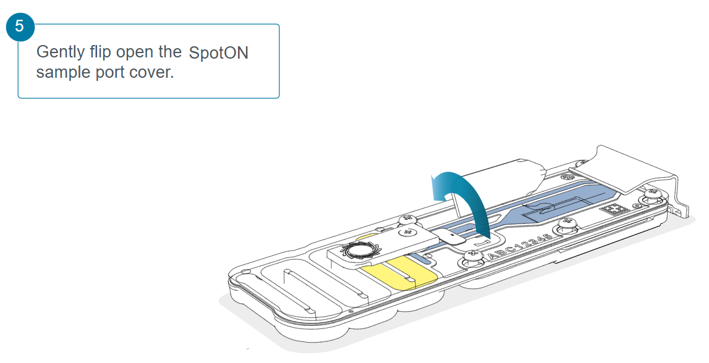
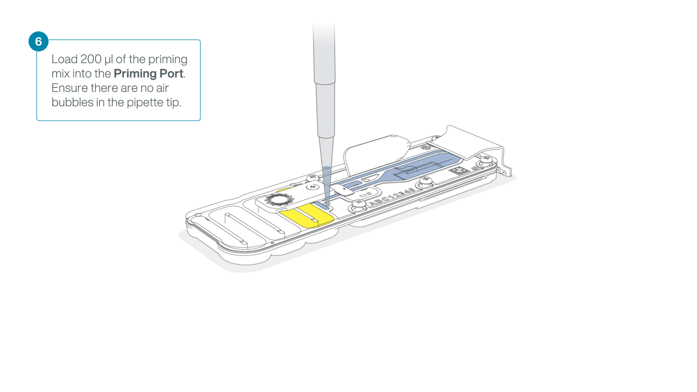
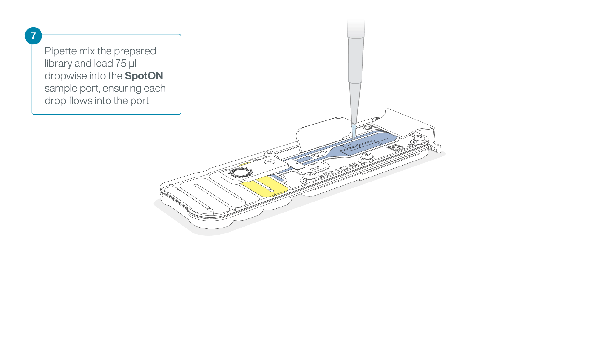

# Rapid Sequencing Kit

##Context

Several patients have arrived at the hospital presenting a clear illness pattern. You have tried to determine which pathogen is, but all your tests have failed, number of cases don't stop and more and more patients arrive at the hospital, the time is running and you need a solution.

You have shared this problems with your boss and, rapidly, you both arrive into a conclusion, sequencing the pathogen. But She wants you to sequence the pathogen using both sequencing techonologies, Illumina and Nanopore. Now is time for you to realise how to do this task, as there is no other bioinformatitian in the hospital. The first thing that we are going to do is consider that our genome is 5.1Mb, but the next questions are tougher, Do we have enough DNA? Which Illumina kit are you going to use if we have an Illumina MiSeq? Can I sequence more than 1 samples in the same Nanopore Flowcell?

Maybe this job is not as good payed as you thought :dizzy_face:

## A bit about Nanopore

Nanopore sequencing is a third-generation sequencing technology that allows us to determine the nucleotide sequences in a sample.

The sample is placed in a flow cell, where it interacts with nanopores located in a sensor array, and an electric current is applied. As each DNA or RNA fragment passes through a nanopore, it causes changes in the ion flow, which alter the current. These changes are linked to the passage of specific nucleotide bases through the nanopores, in a process called basecalling, which identifies the sequence in real time. A key advantage of nanopore sequencing is that, unlike other technologies, it can handle very long fragments of DNA or RNA without size limitations.

Given that the studied genome is 5.1 Mb, if you want to sequence your sample using an Illumina MiSeq System with a coverage of 60X, how many reads would you obtain?

## Output Discussion

Our boss has told us that he wants an Illumina sequencing with a coverage of X60 and paired-end reads. We have a Miseq in our lab, but as you know there are plenty of Illumina kits to sequence in that machine, so maybe you should first think about the output that you know you are going to get with the specifications that your boss told you. Thanks god your old teacher gave you some lessons about how to calculate this during you master.

Question 1(click to reveal)

Given that the studied genome is 5.1 Mb, if you want to sequence your sample using an Illumina MiSeq System with a coverage of 60X, how many reads would you obtain?

Now go to the [Illumina page](https://support.illumina.com/downloads/sequencing_coverage_calculator.html) and make sure that your results are correct.

Question 2(click to reveal)

Which MiSeq Illumina kit should we use if we only have 1 sample? Which one would you use if there were more samples?

In the case of Nanopore we have two different sequencers, the Cancer team is working right now with the PromenthION and we could use it, but in our laboratory we have the MinION and maybe there's no need to bother them. Take into consideration that the Flow Cells for these sequencers are different: the MinION/GridION Flow Cell outputs a maximum of 50 Gb and the PromethION Flow Cell a maximum of 290 Gb.

Question 3(click to reveal)

Knowing this, which sequencer would you use to sequence your sample?

Question 4(click to reveal)

If we use the whole Flow Cell, which cover should we get? 

Question 5(click to reveal)

With the research that we have already done we know that we only need a coverage of X20 with the nanopore reads. Obviously your output is going to be much more bigger, How would you handle it?

## Section 1: Qubit dsDNA HS Assay Kit

The Qubit fluorometer is a device capable of quantifying the amount of DNA, RNA, or proteins present in a sample.

To achieve so, a portion of the sample is mixed with Working Solution, a mixture of buffer and a dye that binds to the target molecule. This dye, when excited in the fluorometer, emits a fluorescent signal. Using standards, Qubit generates a calibration curve that it uses to determine the concentration based on the intensity of the signal, thereby calculating the amount of DNA, RNA, or protein present in the sample.

(The amount of sample used cannot be recovered, so efforts are made to use as little as possible for concentration measurements).

1. Prepare the Qubit working solution by diluting the Qubit dsDNA HS Reagent 1:200 in Qubit dsDNA HS Buffer.
To do so, add 199*(n+1) µl of Buffer and 1*(n+1) µl of Reagent in a Falcon tube.
2. To prepare the standards, add 10 µL of each Qubit standard to the appropriate tube. And mix it with 190 µl of working solution.
3. To prepare the samples, add 1-20 µL of each sample to the appropriate tube. Add the Qubit working solution to each tube such that the final volume is 200 µL.
Recommended: Use 2 µl of sample and fill it up with 198 µl of working solution.
4. Vigorously vortex for 3–5 seconds. Be careful not to create bubbles.
5. Allow all tubes to incubate at room temperature for 2 minutes, then proceed to read standards and samples in a Qubit fluorometer.

## Section2: Library preparation

Among the various kits offered by Oxford Nanopore Technologies (ONT), the Rapid Barcoding Kit has as the fastest and simplest protocol for genomic DNA. Unlike other kits, this one includes an initial fragmentation step. While it may seem counterintuitive, research has shown that this fragmentation actually facilitates longer reads, and ONT suggests that some fragments may be so long that they can become "lost" during library preparation and fragmentation may solve that situation.

After fragmentation, as with the other kits, an adapter must be added to the sequences to enable their binding to the nanopore. Additionally, the sequencing buffer and library beads are included, which provide density to the sample and enhance contact with the nanopores.

At the same time, the flow cell must also be prepared using the flow cell priming mix, which helps, among other things, to maintain an appropriate pH, and stabilize the sequences.

1. Transfer 100-150 ng genomic DNA into a 1.5 ml Eppendorf DNA LoBind tube.
2. Adjust the volume to 10 µl with nuclease-free wáter.
3. In a 0.2ml thin-walled PCR tube, mix 10 μl of template DNA and 1 μl of Fragmentation Mix (FRA).Mix gently.
4. Incubate the tube at 30ºC for 2 minutes and then at 80ºC for 2 minutes. Briefly put the tube on ice to cool it down.
5. Add 1μl of diluted Rapid Adapter (RA) to the tagmented DNA. Mix gently.
6. Incubate the reaction for 5 minutes at room temperatura.

## Section3: Priming and loading the Flow Cell

1. To prepare the flow cell priming mix add 1,170 µl of Flow Cell Flush (FCF) and 30 µl of Flow Cell Tether (FCT) into a 1.5 ml Eppendorf DNA LoBind tube. Mix by pipetting.
2. Slide the flow cell priming port cover clockwise to open the priming port.

3. After opening the priming port, check for a small air bubble under the cover. Draw back a small volume to remove any bubles.

3. Load 800 µl of the priming mix into the flow cell via the priming port, avoiding the introduction of air bubbles. Wait for five minutes.

4. Thoroughly mix the contents of the Library Beads (LIB) by pipetting.
5. In a new 1.5 ml Eppendorf DNA LoBind tube, prepare the library for loading as follows:
- Sequencing Buffer (SB) 37.5 µl
- Library Beads (LIB) mixed immediately before 25.5 µl
- DNA library 12 µl
6. To complete the flow cell priming, gently lift the SpotON sample port cover to make the SpotON sample port accessible.
7. Load 200 µl of the priming mix into the flow cell priming port (not the SpotON sample port), avoiding the introduction of air bubbles.

8. Mix the prepared library gently by pipetting up and down just prior to loading.
9. Add 75 μl of the prepared library to the flow cell via the SpotON sample port in a dropwise fashion. Ensure each drop flows into the port before adding the next.

10. Close the SpotOn port and the priming port.

