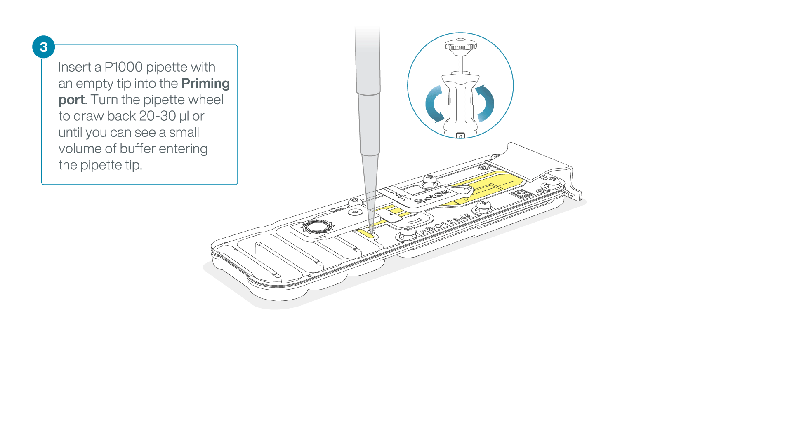

# Rapid Sequencing Kit

## Section 1: Qubit dsDNA HS Assay Kit

1. Prepare the Qubit working solution by diluting the Qubit dsDNA HS Reagent 1:200 in Qubit dsDNA HS Buffer.
To do so, add 199*(n+1) µl of Buffer and 1*(n+1) µl of Reagent in a Falcon tube.
2. To prepare the standards, add 10 µL of each Qubit standard to the appropriate tube. And mix it with 190 µl of working solution.
3. To prepare the samples, add 1-20 µL of each sample to the appropriate tube. Add the Qubit working solution to each tube such that the final volume is 200 µL.
Recommended: Use 2 µl of sample and fill it up with 198 µl of working solution.
4. Vigorously vortex for 3–5 seconds. Be careful not to create bubbles.
5. Allow all tubes to incubate at room temperature for 2 minutes, then proceed to read standards and samples in a Qubit fluorometer.

## Section2: Library preparation
1. Transfer 100-150 ng genomic DNA into a 1.5 ml Eppendorf DNA LoBind tube.
2. Adjust the volume to 10 µl with nuclease-free wáter.
3. In a 0.2ml thin-walled PCR tube, mix 10 μl of template DNA and 1 μl of Fragmentation Mix (FRA).Mix gently.
4. Incubate the tube at 30ºC for 2 minutes and then at 80ºC for 2 minutes. Briefly put the tube on ice to cool it down.
5. Add 1μl of diluted Rapid Adapter (RA) to the tagmented DNA. Mix gently.
6. Incubate the reaction for 5 minutes at room temperatura.

## Section3: Priming and loading the Flow Cell

1. To prepare the flow cell priming mix add 1,170 µl of Flow Cell Flush (FCF) and 30 µl of Flow Cell Tether (FCT) into a 1.5 ml Eppendorf DNA LoBind tube. Mix by pipetting.
2. Slide the flow cell priming port cover clockwise to open the priming port.

3. After opening the priming port, check for a small air bubble under the cover. Draw back a small volume to remove any bubles.

3. Load 800 µl of the priming mix into the flow cell via the priming port, avoiding the introduction of air bubbles. Wait for five minutes.

4. Thoroughly mix the contents of the Library Beads (LIB) by pipetting.
5. In a new 1.5 ml Eppendorf DNA LoBind tube, prepare the library for loading as follows:
- Sequencing Buffer (SB) 37.5 µl
- Library Beads (LIB) mixed immediately before 25.5 µl
- DNA library 12 µl
6. To complete the flow cell priming, gently lift the SpotON sample port cover to make the SpotON sample port accessible.
7. Load 200 µl of the priming mix into the flow cell priming port (not the SpotON sample port), avoiding the introduction of air bubbles.

8. Mix the prepared library gently by pipetting up and down just prior to loading.
9. Add 75 μl of the prepared library to the flow cell via the SpotON sample port in a dropwise fashion. Ensure each drop flows into the port before adding the next.

10. Close the SpotOn port and the priming port.

