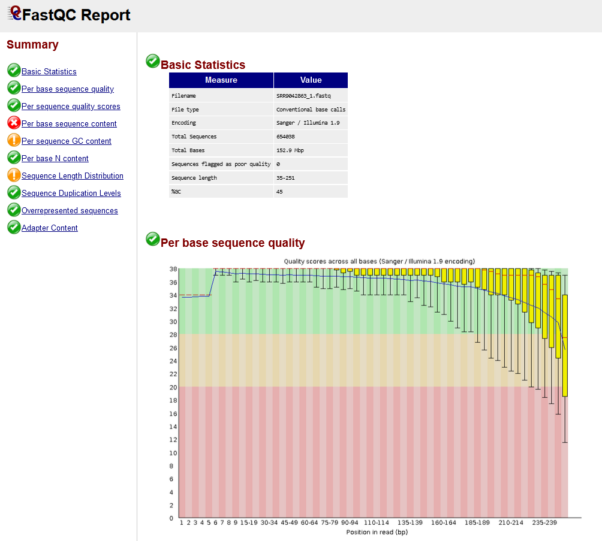
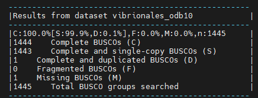
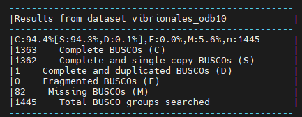

# Hybrid-genome-assembly-practice

For full documentation visit [MSc Bioinformatics moodle](http://bioinformatics-elearning.uab.cat:8080/moodle/).

## Context

Several patients have arrived to the hospital presenting a clear illness pattern.You have tried to determine which pathogen is, but all your tests have failed, the time is running and you need a solution.
You have shared this problems with your boss and, rapidly, you both arrive into a conclusion, sequence the pathogen. With that you will absolutly determine which pathogen has been causing all this troubles, and furthermore, you will know if it has any special characteristic such as antimicrobial resistance genes, pathogenic islands, etc.
To sequence the pathogen you have at your disposal the MinION that Oxoford Nanopore send you some months ago to test it and the hospital's Illumina MiSeq. In this case you would for sure select the Illumina sequencer because is what everybody does and there's plenty of pipelines out there online. But your boss has read that some crazy scientist have started to do something called... Hybrid assembly. 
So she tells you to try it...of course.


## Intro

Assemble a genome!

Learn how to create and assess genome assemblies using the powerful combination of Nanopore and Illumina reads

This tutorial explores how long and short read data can be combined to produce a high-quality ‘finished’ bacterial genome sequence. Termed ‘hybrid assembly’, we will use read data produced from two different sequencing platforms, Illumina (short read) and Oxford Nanopore Technologies (long read), to reconstruct a bacterial genome sequence.

In this tutorial we will perform ‘de novo assembly’. De novo assembly is the process of assembling a genome from scratch using only the sequenced reads as input - no reference genome is used. This approach is common practise when working with microorganisms, and has seen increasing use for eukaryotes (including humans) in recent times.

Long reads can be used together with short reads to produce a high-quality assembly. Nanopore long reads (commonly >40,000 bases) can fully span repeats, and reveal how all the genome fragments should be arranged. Therefore, while long reads will provide the general structure of the genome, short reads will provide that high base-level accuracy needed to close a genome.

**Data:** Nanopore reads, Illlumina reads

**Tools:** `Canu`, `Pilon`, `Unicycler`, `Quast`, `Busco`, `BWA`, `Samtools`,`FastQC`, `Trimmomatic`,`Cutadapt`,`Nanoplot`,`Filtlong`,`Porechop`


## Section 1: Read inspection and QC

In this section we will import and perform quality control (QC) on our data. 

Today we will use 4 pieces of data - **2 short read sets, 1 long read set, and a reference genome** to compare our assembly with. 

<br>

### Getting the data

To get the data we will import our reads directly from the **NCBI SRA database** (Sequence Read Archive) which is the largest publicly available repository of high throughput sequencing data

To download the data we will use the `fasterq-dump` tool from the SRA-toolkit which should be already installed in your conda environment.
We know that the accession ID of our samples is **SRR10345480** and **SRR9042863**. 

Before we start typing and running commands, is important to generate a new directory where all the files are going to be saved and organized.
In our case we are going to create a directory called `hybrid_assembly` and a subdirectory called `data` in this subdirectory is where we are going to save our reads. **Do not move them at any moment**

```bash
mkdir -p hybrid_assembly/data
cd hybrid_assembly/data
fasterq-dump {accesion_ID} #repeat for both accesion IDs
```

### Read inspection

Often, it is prudent to first assess the quality of our read sets. For the short reads, we are concerned with base quality, sequence duplication, and presence of adapter sequences. For nanopore, we want to know about the length and quality distribution of reads, as these may both be highly variable. 

`FastQC` creates summary reports for short read data. We will use this tool twice - once for each Illumina read set. We can then use a tool called `MultiQC` to combine these reports for easy viewing. 

For Nanopore data, `NanoPlot` is a great option. It creates plots which aim to summarise the length and quality distribution of long read sets. 

Depending on these summaries, we may choose to perform a QC step to remove any poor quality reads before proceeding. 


**Run FastQC**

As said before, we will use `FastQC` to see the quality of our **Illumina** reads. Once again, remember **Organization is key**, therefore we are going to create a new directory where we are going to save all our Quality Control outputs
```bash
mkdir -p qc/illumina_raw
cd qc/illumina_raw

fastqc data/SRR*_1.fastq data/SRR*_2.fastq -o -o ./
```

FastQC produces two outputs - 'RawData', and 'Webpage'. Typically, the webpage is for human viewing, and the RawData can be given to other programs, such as MultiQC.

Let's see how the QC went on the Illumina Reads
<br>


<br>

<details>
<summary>Question 1(click to reveal)</summary>
What do you think about them? Do you think they have enough quality? Let's discuss, take your time to inspect the whole html
</details>


**Clean Illumina reads**

It seams that our samples have some unwanted short reads and the quality of some bases is not as good as it could be.
There are plenty of programs such as `trimmomatic` or `cutadapt` that can be used to filter our Illumina reads.First we will get rid of the Illumina adapters, in this case we use Nextera adapters, using `Cutadapt`.
Then we will filter to the get the best possible reads by quality and length using `Trimmomatic` 
```bash
#go to the main directory hybrid_assembly
mkdir -p "qc/trimmomatic"

cutadapt -a CTGTCTCTTATACACATCT -A AGATGTGTATAAGAGACAG -o qc/trimmomatic/out_illumina_1.fastq -p qc/trimmomatic/out_illumina_2.fastq data/SRR9042863_1.fastq data/SRR9042863_2.fastq
trimmomatic PE -threads 4 -phred33 qc/trimmomatic/out_illumina_1.fastq qc/trimmomatic/out_illumina_2.fastq qc/trimmomatic/illumina_trimmed_1.fastq qc/trimmomatic/illumina_unpair_1.fastq qc/trimmomatic/illumina_trimmed_2.fastq qc/trimmomatic/illumina_unpair_2.fastq SLIDINGWINDOW:20:20 MINLEN:250
```

We have generated two **new fastqs** called `illumina_trimmed_1.fastq` and `illumina_trimmed_1.fastq`. :warning: From now on when we say Illumina reads, these are the ones that we are talking about.
Now is time to see how this new fastqs differ from the others.

```bash
mkdir "qc/illumina_trimmed"

fastqc qc/trimmomatic/illumina_trimmed_1.fastq qc/trimmomatic/illumina_trimmed_2.fastq -o qc/illumina_trimmed
```

<br>


<br>

:bangbang: Look at the difference in number of reads between the raw and the trimmed fastqs.


**Run NanoPlot**

As you know the reads of Nanopore are much longer than the Illumina ones, although in some cases (such as 16S experiments) we can use FastQC to look at them, it is better to use
a tool specifically designed for Nanopore, in this case we are going to use `Nanoplot`

```bash
#go to the main directory hybrid_assembly

mkdir -p "qc/nanoplot_raw"
cd qc/nanoplot_raw

NanoPlot -t 4 --fastq ../../data/SRR10*.fastq
```

Our median read length (7,365 pb) is quite good for Nanopore data,although some reads can be even longer, but the mean read quality is not that good (9.7), not so much time ago we would say that this quality is quite nice but the last generation of Nanopore flowcell produce much better reads some of them at the same level as Illumina.
Now as we did before with the Illumina reads, let's clean the Nanopore reads.

**Clean Nanopore reads**

For cleaning our `Nanopore Reads` we will be using `Porechop`and `Filtlong` which are both of the most standarized softwares used for that. `Porechop`is the equivalent of
`Cutadapt` in Illumina and `Filtlong` is the equivalent of `Trimmomatic`.
Why do we need diferent programs to do that? Well, different technologies need diferent approaches, although some of the most popular softwares right now can support all `PacBio`, `Illumina`and `Nanopore`reads.

```bash
#go to the main directory hybrid_assembly

mkdir -p "qc/nanoplot_trimmed"
cd qc/nanoplot_trimmed

porechop -i ../../data/SRR10*.fastq -o ./nanopore_adapter_clean.fastq
filtlong --min_length 1000 --keep_percent 90 --mean_q_weight 9 nanopore_adapter_clean.fastq > nanopore_filtered.fastq
```

:bangbang: As we did with the Illumina reads, from now on when we say nanopore reads we will be refearing to `nanopore_filtered.fastq`

**assign taxonomy of the pathogen**

Now that we have our reads clean, it is always interesting to know what are we looking for. Doing an assembly without knowing what are we facing could be terrible. For example,
imagine that you have assembled a genome with 6 close chormosomes, first of all, congratulations because that is not easy, but then you assign somehow the taxonomy of that organism
and WOW is a Ficus! 🍃 👏👏, and then you realize that ficus is 2n=26 and something has gone wrong.
There is pleanty of ways to assign taxonomy when doing an assembly, for example one of the most used programs to assign taxonomy to illumina reads is `Kraken2`, anoterone used with Nanopore reads
could be `Emu`. But this programs require a powerfull machines, and let's be honest your gaming laptop MSI i9 with 12 Cores and 32 GB of Ram is not as powerful as the clusters that are typically used for this
jobs (we are talking about >40 Cores >100GB ram).

To make things easy and rapid, we are going to de a trick, taking adventage of the length of the nanopore reads, we will select the first read of the `fastq` file, or the second, it doesn't matter whilst is long enough, and all should after the QC that we have done. and we are going to blast it!

```bash
head qc/nanopore_trimmed/nanopore_filtered.fastq #you can also open the file and select the first read
```
now that you have copied the first read, go to [Blastn](https://blast.ncbi.nlm.nih.gov/Blast.cgi?PROGRAM=blastn&PAGE_TYPE=BlastSearch&LINK_LOC=blasthome) and submit a job using the blastn option.
Wow is a _Vibrio parahaemolyticus_, thanks god is not that ficus again!
Go to the NCBI and download in fasta format the [GCA_009649015.1](https://www.ncbi.nlm.nih.gov/datasets/genome/GCF_009649015.1/) genome in a unique `Fasta` file.
Once you have download it, change the name of the fasta to `VP_reference_genome.fasta` and save it in the data directory.

## Section 2: Nanopore draft assembly

### A baseline for "high-quality" assemblies

To begin, we will identify what a high-quality assembly looks like.

When running assembly tools, we want to check the quality of assemblies we produce. It is paramount that genome assemblies are high-quality for them to be useful.

To get a baseline for what is considered a "high-quality" assembly, we will first run a common assembly QC tool - `Busco` - on a published genome similar to the organism we are working with today.

In the moodle you should see a `VP_reference_genome.fasta` item. This is the published genome we will compare against.

**Busco**

`Busco` analysis uses the presence, absence, or fragmentation of key genes in an assembly to determine its quality.

`Busco` genes are specifically selected for each taxonomic clade, and represent a group of genes that each organism in the clade is expected to possess. At higher clades, 'housekeeping genes' are the only members, while at more refined taxa such as order or family, lineage-specific genes can also be used.

We expect the reference genome to have all of these genes. When running `Busco`, we expect it to find most (if not all) of these in the assembly.

Let's create a new directory called `assembly_qc`. We want to create this directory outside from the `qc` directory we have been working on.


> **remember the directory structure we are using**
> 
>hybrid_assembly[data(fastqs), qc(illumina_raw, nanopore_raw, illumina_trimed, fastp), assembly_qc]

```bash
mkdir -p assembly_qc
cd assembly_qc
busco -i ../../data/VP_reference_genome.fasta -l vibrionales -o busco_reference --augustus --mode genome 
```
After the program has run, look at the ‘short summary’ output. It may look something like this:



It seems that BUSCO could find almost all expected genes in the reference genome assembly.
By looking at the results, we see that we have 1443 / 1444 Complete BUSCOs, one being complete and duplicates, and anotherone missing.

This will form the baseline for the BUSCO QC results expected of a high-quality genome assembly.

From here, we will use our input DNA sequence data to assemble the genome of the sequenced organism, and will compare the QC results to that of the published `VP_reference_genome.fasta` assembly.

### Draft assembly with Canu + Nanopore reads

Our first assembly will use the long-read data to create a draft genome, then the short-read data to "polish" (improve) the draft into a better assembly.

We will start by using a long-read assembly tool called `Canu` to create an assembly using the Nanopore long-read data.

Once again we need to create an specific directory for that, let's move again to the general `hibrid_assembly` directory
we will create a directory called `assemblies` where we will compute all the assemblies in this practice

```bash
mkdir -p assemblies/canu
canu -p canu -d assemblies/canu -nanopore qc/nanopore_trimmed/nanopore_filtered.fastq --genomeSize=5.1m
```

We need to compare this assembly with our reference genome. For that we are going to use `Busco` again and `Quast

```bash
#go to the main directory hybrid_assembly

mkdir -p assembly_qc/canu_nanopore
cd assembly_qc/canu_nanopore

busco -i ../../assemblies/canu/conu.contigs.fasta -l vibrionales -o busco --augustus --mode genome --cpu 4

```


<details>
<summary>Question 2(click to reveal)</summary>
As you can see we do not get the same output as the reference, Why do you think this is happening?
</details>

**Quast**

Aside from `Busco`, we can use another method to perform assembly QC. In this case `Quast`allows us to compare two assemblies to determine their similarity.

We know that Bacteria can differ a lot between individuals of the same species, nevertheless they should have the same number of chromosomes with similar lengths. What we are going to do know is compare both `VP_reference_genome.fasta`and this new draft assembly based on Nanopore.

You know what is coming next, Yes! another directory :partying_face:

```bash
#in the same assembly_qc/canu_nanopore directory as before

quast ../../assemblies/canu/conu.contigs.fasta -r ../../data/VP_reference_genome.fasta -o quast
```
The output of `Quast` should be a directory with a set of files, we are interested in the `report.html` file
Now you should be looking at something like this:


what are we looking for? Well there is plenty of information here but you should take a closer look to:
* Genome fraction
* Number of contigs
* Number of misassemblies
* Number of mismatches per 100Kbp
* Number of indels per 100Kbp
* Total length
* Largest contig
* L50
* N50
* LGA50
* NGA50

<details>
<summary>Question 3(click to reveal)</summary>
Which is the differnce between L50 and LGA50? What about N50 and NGA50?
</details>

<details>
<summary>Question 4(click to reveal)</summary>
What do you think about the nanopore assembly? is it good enough for you?
</details>

### Assembly polishing with Pilon

We should be able improve our assembly with the Illumina reads available and correct some of these errors.

This process involves two steps. We will first align the Illumina reads to our draft assembly, then supply the mapping information to Pilon, which will use this alignment information to error-correct our assembly.

Illumina reads have much higher per-base accuracy than Nanopore reads. We will map the Illumina reads to our draft assembly using a short-read aligner called BWA-MEM. Then we can give Pilon this alignment file to polish our draft assembly.

:bangbang: This is maybe one of the most complex steps that we are going to compute so be careful and don't get lost

**Map Illumina reads to Nanopore draft assembly**

To map the Illumina reads to the Nanopore assembly, first we need to index our assembly, for that we will be using `Bwa` and `Samtools`

Indexing is an essential step in many bioinformatics applications, as it can greatly reduce the computational time and resources required for sequence alignment. It allows the alignment algorithm to quickly locate the query sequences in the reference genome, without having to search the entire genome for matches
```bash
#go to the main directory hybrid_assembly

mkdir -p assemblies/error_corrected_canu
cd assemblies/error_corrected_canu
mkdir index

bwa index -p index/index ../canu/canu.contigs.fasta
bwa mem index/index ../../qc/trimmomatic/illumina_trimmed_1.fastq  ../../qc/trimmomatic/illumina_trimmed_2.fastq | samtools sort -o illumina_sorted.bam
samtools index -bc illumina_sorted.bam

```

We should get a BAM file as an output. This is tabular data recording information about how reads were aligned to the draft assembly.
Now we can use that the `illumina_sorted.bam`to run `Pilon`.

```bash
pilon --genome ../canu/canu.contigs.fasta --bam illumina_sorted.bam --outdir pilon -Xmx12G
```
Once `Pilon` has ended we should find a unique **Fasta** file in the `pilon` directory

**Assembly QC**

Now that we have run Pilon, thanks to the help of the illumina reads we should get a much better assembly than before.
But we cannot call ourself scientist only with assumptions we need facts. Therefore, let's run Busco and Quast...yes, again :sleepy:

```bash
#go to the main directory hybrid_assembly

mkdir -p assembly_qc/canu_nanopore_illumina
cd assembly_qc/canu_nanopore_illumina

busco -i ../../assemblies/error_corrected_canu/pilon/pilon.fasta -l vibrionales -o busco --augustus --mode genome --cpu 4
quast ../../assemblies/error_corrected_canu/pilon/pilon.fasta -r ../../data/VP_reference_genome.fasta -o quast
```


<details>
<summary>Question 5(click to reveal)</summary>
What do you think about the results? Do you see any improvements?
</details>

## Section 3: Hybrid assembly - Unicycler

In this section, we will use a purpose-built tool called `Unicycler` to perform hybrid assembly.

`Unicycler` uses our `Nanopore` and `Illumina` read sets together as input, and returns an assembly. Once we have created the assembly, 
we will assess its quality using `Quast` and `Busco` and compare with our previous polished assembly.

`Unicycler` performs assembly in the opposite manner to our approach. `Illumina` reads are used to create an assembly graph, then `Nanopore` reads 
are used to disentangle problems in the graph. The Nanopore reads serve to bridge Illumina contigs, and to reveal how the contigs are arranged 
sequentially in the genome. 

**Run Unicycler**

```bash
#go to the main directory hybrid_assembly

unicycler -1 qc/trimmomatic/illumina_trimmed_1.fastq -2 qc/trimmomatic/illumina_trimmed_2.fastq -l qc/nanopore_trimmed/nanopore_filtered.fastq -o assemblies/unicycler -t 4
```
Once it has ended, if you go to the `assemblies/unicycler` directory, you should find the assembly file called `assembly.fasta`

**Assembly QC**

As we did with the `Canu` and `Pilon` assembly, we need to perform a Quality Control (QC) to our newly assembled genome.

```bash
#go to the main directory hybrid_assembly

mkdir -p assembly_qc/unicycler_alone
cd assembly_qc/unicycler_alone

busco -i ../../assemblies/unicycler/assembly.fasta -l vibrionales -o busco --augustus --mode genome
quast ../../assemblies/unicycler/assembly.fasta -r ../../data/VP_reference_genome.fasta -o quast
```

This are the results that we have obtained from Unicycler:




<details>
<summary>Question 6(click to reveal)</summary>
Which are the differnces between the pilon assembly and this one?
</details>

<details>
<summary>Question 7(click to reveal)</summary>
What do you think about the hybrid assembly? is it good enough for you?
</details>

## Section 4: Nobody expects this combo - Unicycler x Canu

As you have read in the section 4 title, now we are going to do a Unicycler run based on our Canu run, and yes! this is possible.
For that we are going to use the `Unicycler` option `--existing_long_read_assembly`. Remember when we mapped the illumina reads to the Canu draft assembly so`Pilon` could improve
our the assembly? Well let's say this is something similar. This time Unicycler insted of building everything without a base, it will have de Canu_improved_assembly as baseline,
and you will see that this time we will have a better result.

```bash
#go to the main directory hybrid_assembly

mkdir -p assemblies/unicycler_canu
cd assemblies/unicycler_canu

unicycler -1 ../../qc/trimmomatic/illumina_trimmed_1.fastq -2 ../../qc/trimmomatic/illumina_trimmed_2.fastq -l ../../qc/nanopore_trimmed/nanopore_filtered.fastq -o ./ -t 4 --existing_long_read_assembly ../error_corrected_canu/pilon/pilon.fasta
```

I can't believe it! We are at the end, just compute the QC of that assembly and let's go back home :confounded:

```bash
#go to the main directory hybrid_assembly

mkdir -p assembly_qc/unicycler_canu
cd assembly_qc/unicycler_canu

busco -i ../../assemblies/unicycler_canu/assembly.fasta -l vibrionales -o busco --augustus --mode genome --cpu 4
quast ../../assemblies/unicycler_canu/assembly.fasta -r ../../data/VP_reference_genome.fasta -o quast
```


