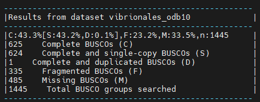

# Hybrid-genome-assembly-practice

For full documentation visit [mkdocs.org](https://www.mkdocs.org).

## Commands

Assemble a genome!

Learn how to create and assess genome assemblies using the powerful combination of Nanopore and Illumina reads

This tutorial explores how long and short read data can be combined to produce a high-quality ‘finished’ bacterial genome sequence. Termed ‘hybrid assembly’, we will use read data produced from two different sequencing platforms, Illumina (short read) and Oxford Nanopore Technologies (long read), to reconstruct a bacterial genome sequence.

In this tutorial we will perform ‘de novo assembly’. De novo assembly is the process of assembling a genome from scratch using only the sequenced reads as input - no reference genome is used. This approach is common practise when working with microorganisms, and has seen increasing use for eukaryotes (including humans) in recent times.

Long reads can be used together with short reads to produce a high-quality assembly. Nanopore long reads (commonly >40,000 bases) can fully span repeats, and reveal how all the genome fragments should be arranged. Therefore, while long reads will provide the general structure of the genome, short reads will provide that high base-level accuracy needed to close a genome.

**Data:** Nanopore reads, Illlumina reads, bacterial organism (_Vibrio parahaemolyticus_) reference genome

**Tools:** `Flye`, `Pilon`, `Unicycler`, `Quast`, `Busco`, `BWA`, `Samtools`,`FastQC`, `Fastp`,`nanoplot`

## Section 1: Read inspection and QC

In this section we will import and perform quality control (QC) on our data. 

Today we will use 4 pieces of data - **2 short read sets, 1 long read set, and a reference genome** to compare our assembly with. 

<br>

### Getting the data

To get the data we will import our reads directly from the **NCBI SRA database** (Sequence Read Archive) which is the largest publicly available repository of high throughput sequencing data

To download the data we will use the `fasterq-dump` tool from the SRA-toolkit which should be already installed in your conda environment.
We know that the accession ID of our samples is **SRR10022815** and **SRR10022816**. 

Before we start typing and running commands, is important to generate a new directory where all the files are going to be saved and organized.
In our case we are going to create a directory called `hybrid_assembly` and a subdirectory called `data` in this subdirectory is where we are going to save our reads. **Do not move them at any moment**

```bash
mkdir -p hybrid_assembly/data
cd hybrid_assembly/data
fasterq-dump {accesion_ID} #repeat for both accesion IDs
```

### Read inspection

Often, it is prudent to first assess the quality of our read sets. For the short reads, we are concerned with base quality, sequence duplication, and presence of adapter sequences. For nanopore, we want to know about the length and quality distribution of reads, as these may both be highly variable. 

`FastQC` creates summary reports for short read data. We will use this tool twice - once for each Illumina read set. We can then use a tool called `MultiQC` to combine these reports for easy viewing. 

For Nanopore data, `NanoPlot` is a great option. It creates plots which aim to summarise the length and quality distribution of long read sets. 

Depending on these summaries, we may choose to perform a QC step to remove any poor quality reads before proceeding. 


**Run FastQC**

As said before, we will use `FastQC` to see the quality of our **Illumina** reads. Once again, remember **Organization is key**, therefore we are going to create a new directory where we are going to save all our Quality Control outputs
```bash
mkdir -p qc/illumina_raw
cd qc/illumina_raw

fastqc ../../data/SRR10022816_1.fastq ../../data/SRR10022816_2.fastq -o ./
```

FastQC produces two outputs - 'RawData', and 'Webpage'. Typically, the webpage is for human viewing, and the RawData can be given to other programs, such as MultiQC.

Let's see how the QC went on the Illumina Reads
<br>


<br>

<details>
<summary>Question 1(click to reveal)</summary>
What do you think about them? Do you think they have enough quality? Let's discuss, take your time to inspect the whole html
</details>


**Run Fastp**

It seams that our samples have some unwanted short reads and the quality of some bases is not as good as it could be.
There are plenty of programs such as `trimmomatic` or `cutadapt` that can be used to filter our Illumina reads, but for making this exercise a bit simplier
today we will use `Fastp`. we will use `-l` to set the minimum length of the filtered reads and `-q` to set the minimum phred quality
```bash
cd ..
mkdir fastp
cd fastp
fastp -i ../../data/SRR10022816_1.fastq -I ../../data/SRR10022816_2.fastq \
-o ./SRR10022816_trimmed_1.fastq -O ./SRR10022816_trimmed_2.fastq -l 240 -q 30
```

We have generated two **new fastqs** called `SRR10022816_trimmed_1.fastq` and `SRR10022816_trimmed_2.fastq`. :warning: From now on when we say Illumina reads, these are the ones that we are talking about.
Now is time to see how this new fastqs differ from the others

```bash
cd ..
mkdir illumina_trimmed
cd qc/illumina_trimmed

fastqc ../fastp/SRR10022816_trimmed_1.fastq ../fastp/SRR10022816_trimmed_2.fastq -o ./
```

:bangbang: Look at the difference in number of reads between the raw and the trimmed fastqs.


**Run NanoPlot**

As you know the reads of Nanopore are much longer than the Illumina ones, although in some cases (such as 16S experiments) we can use FastQC to look at them, it is better to use
a tool specifically designed for Nanopore, in this case we are going to use `Nanoplot`

```bash
cd ..
mkdir nanopore_raw
cd nanopore_raw
NanoPlot -t 4 --fastq ../../data/SRR10022815.fastq 
```

Our median read length (7044 bp) is quite good for Nanopore data,although some reads can be even longer, but the median quality is not that good (10.3), not so much time ago we would say that this quality is quite nice but the last generation of Nanopore flowcell produce much better reads some of them at the same level as Illumina, but for this exercise we will continue with what we have

## Section 2: Nanopore draft assembly

### A baseline for "high-quality" assemblies

To begin, we will identify what a high-quality assembly looks like.

When running assembly tools, we want to check the quality of assemblies we produce. It is paramount that genome assemblies are high-quality for them to be useful.

To get a baseline for what is considered a "high-quality" assembly, we will first run a common assembly QC tool - `Busco` - on a published genome similar to the organism we are working with today.

In the moodle you should see a `VP_reference_genome.fasta` item. This is the published genome we will compare against.

**Busco**

`Busco` analysis uses the presence, absence, or fragmentation of key genes in an assembly to determine its quality.

`Busco` genes are specifically selected for each taxonomic clade, and represent a group of genes that each organism in the clade is expected to possess. At higher clades, 'housekeeping genes' are the only members, while at more refined taxa such as order or family, lineage-specific genes can also be used.

We expect the reference genome to have all of these genes. When running `Busco`, we expect it to find most (if not all) of these in the assembly.

Let's create a new directory called `assembly_qc`. We want to create this directory outside from the `qc` directory we have been working on.


> **remember the directory structure we are using**
> 
>hybrid_assembly[data(fastqs), qc(illumina_raw, nanopore_raw, illumina_trimed, fastp), assembly_qc]

```bash
mkdir -p assembly_qc
cd assembly_qc
busco -i ../../data/VP_reference_genome.fasta -l vibrionales -o busco_reference --augustus --mode genome 
```
After the program has run, look at the ‘short summary’ output. It may look something like this:


It seems that BUSCO could find almost all expected genes in the reference genome assembly.
By looking at the results, we see that we have 1445 / 1445 Complete BUSCOs, one being complete and duplicates.

This will form the baseline for the BUSCO QC results expected of a high-quality genome assembly.

From here, we will use our input DNA sequence data to assemble the genome of the sequenced organism, and will compare the QC results to that of the published `VP_reference_genome.fasta` assembly.

### Draft assembly with Flye + Nanopore reads

Our first assembly will use the long-read data to create a draft genome, then the short-read data to "polish" (improve) the draft into a better assembly.

We will start by using a long-read assembly tool called "Flye" to create an assembly using the Nanopore long-read data.

Once again we need to create an specific directory for that, let's move again to the general `hibrid_assembly` directory
we will create a directory called `assemblies` where we will compute all the assemblies in this practice

```bash
mkdir -p assemblies/nanopore_draft
cd assemblies/nanopore_draft
flye --nano_hq ../../data/SRR10022815.fastq -o ./
```

this are the results from our run:


with that info we already can get an idea of how good is our draft assembly, but let's compare this assembly with our reference genome. For that we are going to use `Busco` again and `Quast

```bash
cd assembly_qc

busco -i ../assemblies/nanopore_draft/assembly.fasta -l vibrionales -o busco_draft_nanopore --augusutus --mode genome
```



<details>
<summary>Question 2(click to reveal)</summary>
As you can see we do not get the same output as the reference, Why do you think this is happening?
</details>

**Quast**

Aside from `Busco`, we can use another method to perform assembly QC. In this case `Quast`allows us to compare two assemblies to determine their similarity.

We know that Bacteria can differ a lot between individuals of the same species, nevertheless they should have the same number of chromosomes with similar lengths. What we are going to do know is compare both `VP_reference_genome.fasta`and this new draft assembly based on Nanopore.

You know what is coming next, Yes! another directory :partying_face:

```bash
#go to the assembly_qc directory

mkdir quast_draft_nanopore
cd quast_draft_nanopore
quast ../../assemblies/nanopore_draft/assembly.fasta -r ../../data/VP_reference_genome.fasta
```
The output of `Quast` should be a directory with a set of files, we are interested in the `report.html` file
Now you should be looking at something like this:


what are we looking for? Well there is plenty of information here but you should take a closer look to:
* Genome fraction
* Number of contigs
* Number of misassemblies
* Number of mismatches per 100Kbp
* Number of indels per 100Kbp
* Total length
* Largest contig
* L50
* N50
* LGA50
* NGA50

<details>
<summary>Question 3(click to reveal)</summary>
Which is the differnce between L50 and LGA50? What about N50 and NGA50?
</details>

<details>
<summary>Question 4(click to reveal)</summary>
What do you think about the nanopore assembly? is it good enough for you?
</details>

### Assembly polishing with Pilon

We should be able improve our assembly with the Illumina reads available and correct some of these errors.

This process involves two steps. We will first align the Illumina reads to our draft assembly, then supply the mapping information to Pilon, which will use this alignment information to error-correct our assembly.

Illumina reads have much higher per-base accuracy than Nanopore reads. We will map the Illumina reads to our draft assembly using a short-read aligner called BWA-MEM. Then we can give Pilon this alignment file to polish our draft assembly.

:bangbang: This is maybe one of the most complex steps that we are going to compute so be careful and don't get lost

**Map Illumina reads to Nanopore draft assembly**

To map the Illumina reads to the Nanopore assembly, first we need to index our assembly, for that we will be using `Bwa` and `Samtools`

Indexing is an essential step in many bioinformatics applications, as it can greatly reduce the computational time and resources required for sequence alignment. It allows the alignment algorithm to quickly locate the query sequences in the reference genome, without having to search the entire genome for matches
```bash
#return to the assemblies directory

mkdir nano_index
mkdir illumina_bam
bwa index -p nano_index/nano_index nanopore_draft/assembly.fasta
cd illumina_bam
bwa nano_index/nano_index ../qc/fastp/SRR10022816_trimmed_1.fastq ../qc/fastp/SRR10022816_trimmed_2.fastq | samtools sort -o illumina_sorted.bam
samtools index -bc illumina_sorted.bam
```

We should get a BAM file as an output. This is tabular data recording information about how reads were aligned to the draft assembly.
Now we can use that the `illumina_sorted.bam`to run `Pilon`.

```bash
cd ..
pilon --genome nanopore_draft/assembly.fasta --bam illumina_bam/illumina_sorted.bam --outdir pilon_assembly
```
Once `Pilon` has ended we should find a unique Fasta file in the `pilon_assembly` directory

**assembly QC**

Now that we have run Pilon, thanks to the help of the illumina reads we should get a much better assembly than before.
But we cannot call ourself scientist only with assumptions we need facts. Therefore, let's run Busco and Quast...yes, again :sleepy:

```bash
#return to the assembly_qc directory

mkdir busco_pilon
cd busco_pilon
busco -i ../../assemblies/pilon_assembly/pilon_assembly.fasta -l vibrionales -o ./ --augustus --mode genome
cd ../
mkdir quast_pilon
cd quast_pilon
quast ../../assemblies/pilon_assembly/pilon_assembly.fasta -r ../../data/VP_reference_genome.fasta
```

